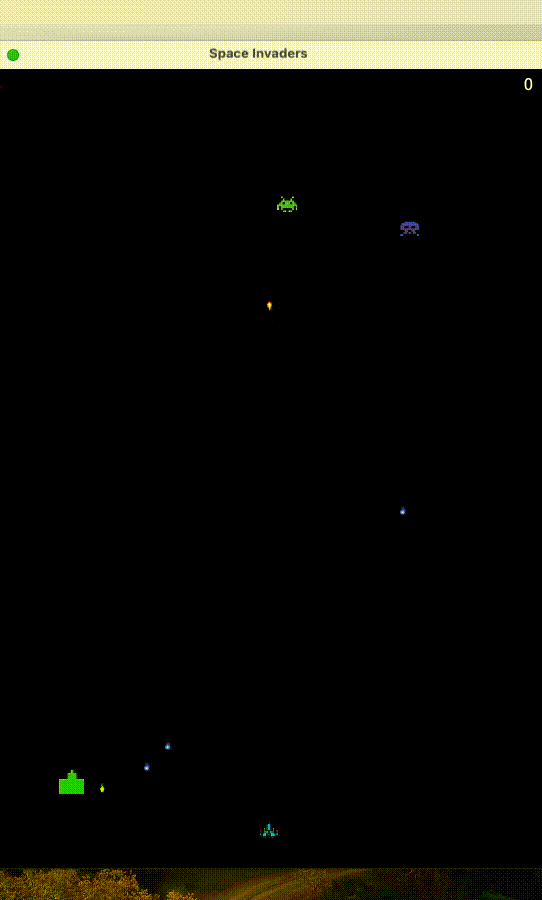

# Space Invader

## Table of Contents
- [Space Invader](#space-invader)
  - [Table of Contents](#table-of-contents)
  - [Technology](#technology)
  - [Execution](#execution)
  - [Features](#features)
  - [Demo](#demo)

## Technology
- Java as programming language.
- JavaFX package for graphics.
- Gradle for dependency manager.

## Execution
- Download and install Java at this [website](https://www.java.com/en/download/help/download_options.html)
- Download and install Gradle at this [website](https://gradle.org/install/)
- Download and install JavaFX at this [website](https://openjfx.io)
- Create an empty folder, then open it with a code editor.
- Clone the project with git.
- Change current directory to the parent folder that contains the folder `src`.
- Run: ```gradle clean build run```.

## Features
- Player can configure the game by `.config` files, there are three `.config` files, each corresponds to a level (easy, medium, or hard):
  - Configure game size with `x` for width and `y` for height.
  - Configure player's speed, lives, and initial position.
  - Configure number of bunkers, their sizes and positions.
  - Configure number of enemies, their positions and projectile types (will influence their speed).
- In the game, the player can:
  - Move a ship horizontally within the game frame.
  - Shoot projectiles to eliminate enemies.
  - Change game level with keyboard keys: `<1>` for the Easy level, `<2>` for the Medium one and `<3>` for the Hard one. Note that each time the player switches to a level (even with the same level), the time and score will be reset to 0, as if the user has restarted the game.
  - Undo: Each time the player shoots (i.e., pressing the spacebar), the current state of the game (game configuration, time, score, player's position, player's projectiles (excluding the last shot), enemies, enemies positions, enemies projectiles, bunkers and bunkers states) will be saved by the game. Also, there is only one state, the subsequent saves will overwrite the existing one. The player can undo by pressing the `<R>` key on the keyboard.
  - Pressing `<A>` will remove all slow projectiles on the game screen and add 1 to the player's score for each slow projectile being removed.
  - Pressing `<S>` will remove all fast projectiles on the game screen and add 2 to the player's score for each fast projectile being removed.
  - Pressing `<D>` will remove all slow enemies on the game screen and add 3 to the player's score for each slow enemies being removed.
  - Pressing `<F>` will remove all fast enemies on the game screen and add 4 to the player's score for each fast enemies being removed.

- The game is clocked with format "0:00" where the first "0" indicates minutes and the second "00" indicates seconds. The time is shown on the upper left corner of the screen and the score is shown on the upper right corner. The clock will stop if either the player destroys all enemies (won the game) or the player is destroyed (lose the game).

## Demo
